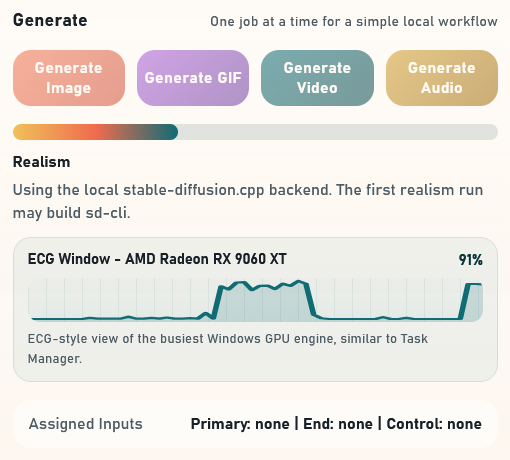

# ECG Window

Tiny, language-agnostic activity monitor for long-running local workloads.

The ECG Window is meant to feel like a medical monitor:

- flat line = little or no activity
- spikes = work is happening
- steady rhythm = the machine is actively chewing through a job

Its job is not deep telemetry. Its job is reassurance.



## Why This Repo Exists

Most generation tools feel frozen while they are actually busy. A tiny moving graph gives users a fast answer to one question:

> Is this thing still alive?

This repository is built so developers can copy the pattern into their own stack without needing this repo's runtime, framework, or language choices.

If you want the plain-English case for shipping it, read [`docs/why-use-this.md`](docs/why-use-this.md).

## What You Copy

To add an ECG Window to a project, you only need four parts:

1. A signal source that can produce activity samples from `0` to `100`
2. A rolling history buffer
3. A tiny contract that exposes the current value plus recent history
4. A small renderer that draws the ECG Window trace and current percentage

## Start Here

If you only read three things:

1. [`docs/zero-knowledge-user-guide.md`](docs/zero-knowledge-user-guide.md) for the plain-English overview
2. [`docs/signal-sources.md`](docs/signal-sources.md) for the least-pain signal choice on each OS
3. [`copy-paste/00-starter-pack.md`](copy-paste/00-starter-pack.md) for the end-to-end copy-paste reference

## Quick Start

1. Pick a signal source using [`docs/signal-sources.md`](docs/signal-sources.md).
2. Read [`spec/ecg-window-contract.md`](spec/ecg-window-contract.md) for the field meanings and state model.
3. Use [`spec/ecg-window.schema.json`](spec/ecg-window.schema.json) if you want a canonical snake_case JSON contract.
4. Start from [`copy-paste/00-starter-pack.md`](copy-paste/00-starter-pack.md) for the fastest implementation path.
5. Pull focused pieces from [`copy-paste/01-sampler-loop.md`](copy-paste/01-sampler-loop.md), [`copy-paste/02-rolling-buffer.md`](copy-paste/02-rolling-buffer.md), [`copy-paste/03-backend-contract.md`](copy-paste/03-backend-contract.md), [`copy-paste/04-ecg-window-renderer.md`](copy-paste/04-ecg-window-renderer.md), and [`copy-paste/05-failure-handling.md`](copy-paste/05-failure-handling.md) as needed.

## Optional Drop-In Examples

If you want a concrete starting point instead of pseudocode:

- [`examples/typescript/ecg-window.ts`](examples/typescript/ecg-window.ts)
- [`examples/python/ecg_window.py`](examples/python/ecg_window.py)
- [`examples/csharp/EcgWindow.cs`](examples/csharp/EcgWindow.cs)
- [`examples/rust/ecg_window.rs`](examples/rust/ecg_window.rs)
- [`examples/react/EcgWindow.tsx`](examples/react/EcgWindow.tsx)
- [`examples/browser/ecg-window.js`](examples/browser/ecg-window.js)
- [`examples/tauri/ecg-window.ts`](examples/tauri/ecg-window.ts)
- [`examples/wpf/EcgWindowControl.xaml`](examples/wpf/EcgWindowControl.xaml)
- [`examples/python-tkinter/ecg_window_tk.py`](examples/python-tkinter/ecg_window_tk.py)

See [`examples/README.md`](examples/README.md) for the quick chooser.

## Canonical Payload

```json
{
  "supported": true,
  "available": true,
  "label": "ECG Window - AMD Radeon RX 9060 XT",
  "note": "ECG-style view of the busiest local compute signal.",
  "current_percent": 73.0,
  "history": [12.0, 31.0, 78.0, 64.0, 81.0]
}
```

## State Model

- `supported = false`, `available = false`: this environment or app integration does not support ECG Window telemetry
- `supported = true`, `available = false`: telemetry is supported, but a fresh sample is not currently available
- `supported = true`, `available = true`: telemetry is live and the ECG Window should render normally

`supported = false` with `available = true` is not a valid state.

## Design Rules

- Keep it small.
- Keep it passive.
- Keep it glanceable.
- Avoid turning it into a full monitoring suite.
- Prefer human-friendly language over hardware jargon.
- Fail gently if telemetry is missing.

## Good Defaults

- Poll interval: `1200ms` to `2000ms`
- History length: `40` to `60`
- Value range: always clamp to `0..100`
- UI size: status-bar sized or small panel sized
- Fallback: hide the widget or show `temporarily unavailable`

## Picking a Signal Source

This pattern works with any activity signal as long as it can be normalized to a percentage.

Preferred order:

1. GPU activity
2. CPU activity
3. Queue activity or worker utilization
4. Any other signal that tells the truth about whether work is happening

The short version:

- if the platform gives you a clean local GPU percentage, use that
- if GPU telemetry is awkward, use CPU
- if OS telemetry is fragmented, use an honest app-level signal like worker occupancy or queue activity

See [`docs/signal-sources.md`](docs/signal-sources.md) for OS-by-OS guidance.

## Pick Your Shape

The ECG Window usually fits into one of these implementation shapes:

1. Same-process state
   Best for desktop apps, local tools, and in-process dashboards
2. Local endpoint plus polling UI
   Best when a backend sampler and frontend renderer are already separate
3. Push updates
   Best when your app already streams state over websockets, IPC, or a reactive store

Whichever path you choose, keep the payload small and the renderer passive.

## Repo Layout

```text
assets/
  ecg-window-live-screenshot.png
  ecg-window-example.svg
examples/
  README.md
  typescript/ecg-window.ts
  python/ecg_window.py
  csharp/EcgWindow.cs
  rust/ecg_window.rs
  react/EcgWindow.tsx
  browser/ecg-window.js
  browser/index.html
  tauri/ecg-window.ts
  wpf/EcgWindowControl.xaml
  wpf/EcgWindowControl.xaml.cs
  wpf/EcgWindowPayload.cs
  python-tkinter/ecg_window_tk.py
LICENSE
README.md
copy-paste/
  00-starter-pack.md
  01-sampler-loop.md
  02-rolling-buffer.md
  03-backend-contract.md
  04-ecg-window-renderer.md
  05-failure-handling.md
docs/
  architecture.md
  porting-checklist.md
  signal-sources.md
  ui-guidelines.md
  why-use-this.md
  zero-knowledge-user-guide.md
spec/
  ecg-window-contract.md
  ecg-window.example.json
  ecg-window.schema.json
  ecg-window.temporarily-unavailable.example.json
  ecg-window.unsupported.example.json
ecg_window.md
```

## License

This repository is licensed under the GNU Affero General Public License v3.0.

See [`LICENSE`](LICENSE) for the full license text.

Because this repo is designed to be copied into other projects, review the AGPLv3 terms before reusing code, pseudocode, or other substantial material from it.

## Original Concept Note

The initial feature description that shaped this repo is preserved in [`ecg_window.md`](ecg_window.md).
